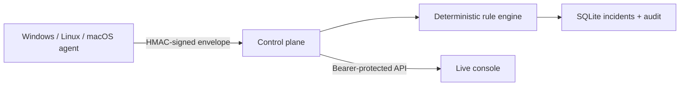

# OpsAtlas

[](https://github.com/ReedStel/OpsAtlas/actions/workflows/ci.yml)


OpsAtlas is a privacy-first fleet health and incident command console. A small
cross-platform agent sends bounded, signed health envelopes to a Node.js control
plane; the control plane validates them, evaluates deterministic rules, stores
state in SQLite, and feeds a responsive operations console.

The browser opens in an unmistakably labelled fictional demo mode, so the UI is
safe to show immediately. It can also connect to the protected API and display
real lab telemetry without rebuilding the frontend.

## Why this project exists

Monitoring agents are powerful, which makes their data boundary important.
OpsAtlas deliberately demonstrates the useful operational layer without adding
host discovery, file collection, process inspection, or remote execution.



## v1 capabilities

- polished responsive console with topology, fleet, incidents, rules, search,
  node inspection, explicit demo/live states, and browser-session credentials
- HMAC-SHA256 authentication over the exact request body and timestamp
- freshness and persisted monotonic-sequence checks against replay
- strict schema bounds, a 64 KiB payload ceiling, security headers, and a narrow
  CORS allowlist
- deterministic disk, memory, CPU, service-check, and stale-heartbeat incidents
- durable device state, open/resolved incident history, and audit events in
  SQLite
- one-time enrollment tokens plus agent key rotation and revocation
- AES-256-GCM encryption for enrolled keys at rest, with the encryption secret
  kept outside the database
- atomic agent state writes with owner-only file permissions
- container images, persistent Compose volumes, health endpoint, admin CLI, and
  twelve service/security tests

## Privacy boundary

The agent reports only a user-chosen device ID, OS family, architecture,
resource percentages, uptime, and results from explicitly configured HTTP
checks. It does **not** collect usernames, file names or contents, IP or MAC
addresses, environment variables, process lists, browser data, installed
software, or nearby hosts. It cannot scan ports or execute remote commands.

All fixtures and screenshots in this repository are fictional. Never commit
real infrastructure names, credentials, production telemetry, or private
workplace details.

## Try the console

Requires Node.js 22.13 or newer.

```bash
npm ci
npm run dev
```

Open the local URL printed by Vite. Demo mode works with no services or secrets.
The `DEMO DATA` badge opens the connection dialog when a control plane is
available.

## Run the full local lab

The shortest safe flow is:

1. Copy `.env.example` values into your environment and replace every
   `generate-...` placeholder with a fresh random value.
2. Build and start the control plane.
3. Issue a one-time enrollment token for a fictional lab device.
4. Start the agent with that token. The exchanged agent key is then retained in
   its private state file.

```bash
npm run build:services
npm run start:control

# In another shell with the same dashboard token:
npm run admin -- enrollment demo-node-01 600

# Set the returned one-time token, then:
npm run start:agent
```

Connect the console to `http://127.0.0.1:4318` and enter the dashboard token.
See [the complete quick start](docs/quickstart.md) for native and Docker flows.

## Admin operations

The dependency-free CLI calls the same protected API as an operator:

```bash
npm run admin -- agents
npm run admin -- enrollment demo-node-02 600
npm run admin -- rotate demo-node-02
npm run admin -- revoke demo-node-02
```

Enrollment tokens and replacement keys are intentionally returned once. Treat
that terminal output as sensitive.

## Verification

```bash
npm run lint
npm run test:services
npm test
```

`npm run check` runs the full local verification sequence. GitHub Actions runs
the same lint, service tests, production console build, and render smoke test on
every pull request.

## Documentation

- [Quick start and configuration](docs/quickstart.md)
- [API reference](docs/api.md)
- [Architecture and data flow](docs/architecture.md)
- [Threat model](docs/threat-model.md)
- [Distribution model](docs/distribution.md)
- [Security reporting](SECURITY.md)

## Project status

OpsAtlas v1 is a working portfolio-grade lab system, not a production monitoring
service. It is single-operator, has no built-in TLS or rate limiter, and has not
received an independent security audit. Put it behind TLS before any traffic
crosses an untrusted network.

## Licence

Copyright © 2026 Reed Stelfox. All rights reserved. OpsAtlas is public and
source-available, not open source. The licence permits viewing, GitHub forking,
and running an unmodified copy for personal non-commercial evaluation; it does
not permit modification, redistribution, rebranding, or commercial use. Read
[LICENSE](LICENSE) before using the software.
