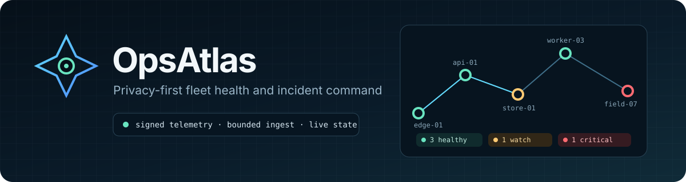
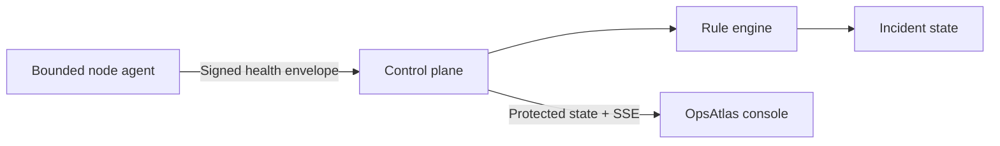

<p align="center">
  
</p>

<p align="center">
  <a href="https://github.com/ReedStel/OpsAtlas/actions/workflows/ci.yml"></a>
  
  
  <a href="LICENSE"></a>
</p>

OpsAtlas is a privacy-first fleet health and incident command console. It turns
small, signed health reports from Windows, Linux, and macOS nodes into one live
operational picture: topology, resource pressure, deterministic alerts, and a
response trail.

This is a public, source-available portfolio build. The interface ships with
clearly labelled fictional demo data; the telemetry path is real and covered by
tests.

## What is working

- responsive command console with overview, fleet, incidents, and rule views
- interactive topology and node inspector
- incident filtering and acknowledgement flow
- cross-platform Node.js telemetry agent
- HMAC-SHA256 payload authentication with timestamp and sequence replay protection
- bounded 64 KiB ingestion, schema validation, and restricted CORS
- live state stream over server-sent events
- deterministic disk, memory, CPU, service, and stale-heartbeat rules
- control-plane integration tests, signature tests, and rule tests

## Privacy boundary

The agent reports only a user-chosen device ID, OS family, architecture,
resource percentages, uptime, and the result of explicitly configured HTTP
checks. It does **not** collect usernames, file names or contents, IP or MAC
addresses, environment variables, process lists, browser data, or nearby hosts.
There is no port scanning and no remote-command feature.

## Architecture



The starter dashboard uses fictional in-browser data so the interface can be
reviewed without running an agent. `services/` contains the real ingestion path
that will replace that adapter when persistence and authentication are wired for
a deployment.

## Local development

Requires Node.js 22.13 or newer.

```bash
npm ci
npm run dev
```

To compile and test the service layer:

```bash
npm run test:services
```

To run a local control plane, copy `.env.example` values into your shell with
fresh random keys, then:

```bash
npm run build:services
npm run start:control
```

In a second shell, configure the matching device ID/key and run:

```bash
npm run start:agent
```

The control plane binds to `127.0.0.1` by default. Exposing it to a network is an
explicit operator decision and should be done only behind TLS with a dashboard
token and a narrow origin allowlist.

## Verification

```bash
npm run lint
npm run test:services
npm test
npm run validate:artifact
```

### Sixty-second review

For a quick technical review, open the dashboard, switch between fleet and incident views, then
inspect the HMAC/replay tests in `services/tests/protocol.test.mjs` and the authenticated ingestion
flow in `services/tests/server.test.mjs`. The threat model in `docs/threat-model.md` records what the
current controls cover and what still belongs at a real deployment boundary.

## Status

OpsAtlas is an engineering portfolio project, not a production monitoring
service. Current state is kept in memory and is lost when the control plane
stops. The next deliberate milestones are durable storage, user authentication,
agent enrolment/rotation, and dashboard-to-control-plane integration.

## Licence

Copyright © 2026 Reed Stelfox. All rights reserved. OpsAtlas is source-available,
not open source. You may inspect, fork, and run the unmodified project for
personal evaluation; modification, redistribution, rebranding, and commercial
use are prohibited. Read [LICENSE](LICENSE) before using the software.
