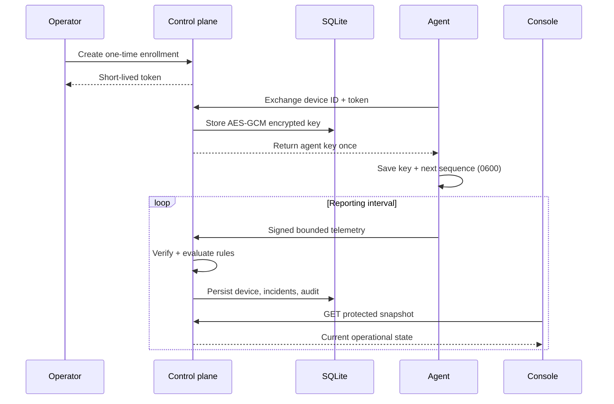

# Architecture

OpsAtlas separates collection, decision-making, persistence, and presentation.
Each process has a narrow job and the agent-to-control-plane boundary is an
authenticated, versioned protocol.

## Data flow

## Agent

The Node.js agent runs on Windows, Linux, or macOS. It reads coarse CPU, memory,
disk, and uptime values and performs only HTTP checks explicitly supplied by the
operator. It serialises a schema-v1 envelope and authenticates the exact JSON
bytes with HMAC-SHA256.

The signature covers a millisecond timestamp and the body. The envelope also
contains a monotonically increasing sequence. The next sequence and an enrolled
key are written through a same-directory temporary file and atomic rename, then
restricted to owner read/write permissions.

## Control plane

The HTTP server rejects telemetry before state changes unless all of these pass:

- body size is at most 64 KiB;
- the device exists in the credential registry;
- timestamp is within the five-minute acceptance window;
- HMAC signature matches in constant time;
- body device matches the signed device header;
- schema, strings, metrics, checks, and numeric ranges are valid; and
- sequence is greater than the last persisted sequence for that device.

Rules are deterministic functions. The store deduplicates active incidents by
device and rule fingerprint, resolves them when a healthy sample arrives, and
records lifecycle events in the audit trail.

## Persistence and credentials

SQLite stores the latest device envelope, active and resolved incidents, audit
events, and enrolled credentials. WAL mode is enabled for file databases.
Enrolled agent keys are encrypted with AES-256-GCM; the device ID is bound as
additional authenticated data. `OPSATLAS_CREDENTIAL_KEY` is hashed to the
encryption key and must be stored separately from the database.

Enrollment tokens are random, short-lived, one-time values. Only their SHA-256
digests are kept in memory. Static keys remain available as a migration path
through `OPSATLAS_AGENT_KEYS`, but managed enrollment is the recommended flow.

## Console

The React console starts with clearly marked fictional data. A connection dialog
can attach it to `/api/v1/state`; the dashboard token is held only in React state
and browser `sessionStorage`, never compiled into the bundle or localStorage.
The console polls every five seconds because native `EventSource` cannot attach
the required Authorization header. The SSE endpoint remains available to
non-browser clients that can send bearer authentication.

## Deliberate non-features

- no network or port discovery
- no file, software inventory, or process collection
- no remote shell, script execution, or automatic remediation
- no hidden behavioural analytics
- no multi-tenant identity model

These constraints reduce the blast radius of agent compromise and keep the
collection boundary easy to explain during review.
